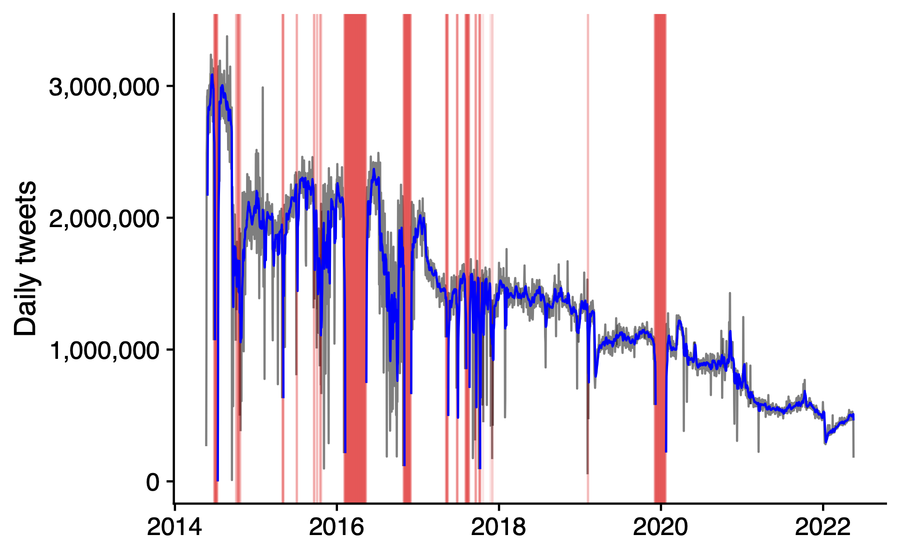

# county-sentiment-data
Dataset of average online sentiment by US county-date (2014-2022)

## Data construction

I compute daily averages of county sentiment from 3.5 billion geolocated Twitter social media posts (tweets) that I collected using the (now-discontinued) Twitter Streaming API between 2014-05-22 and 2022-05-18. Each post's sentiment is computed using the compound score from the [VADER](https://github.com/vaderSentiment/vaderSentiment) sentiment analysis algorithm. 

After computing the timezone and local datetime of each post, I compile averages by county-date (i.e., only county-dates with at least one tweet are included). The final dataset includes the following variables, where (*) indicates the unique keys:

- `fips` (*): County FIPS identifier.
- `date` (*): Date computed from local time
- `sent`: Average sentiment `sent`
- `N`: Number of tweets included in the average

In total, the dataset includes 6,972,641 observations and represents 3,456,549,038 tweets.

##  Descriptive statistics

The figure below shows the number of tweets included in the data over time. There are a few gaps, typically due to my connection to the API failing for one reason or other. The downward trend in the number of tweets is (I think) due to a combination of declining Twitter activity during this time period and a smaller proportion of tweets being geolocated as a result of changes to the Twitter interface

{width=50%}

The maps below show the spatial distributions of the number of tweets and average sentiment.

{width=75%}

{width=75%}